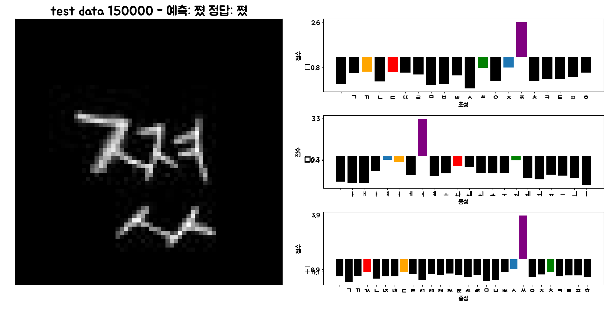
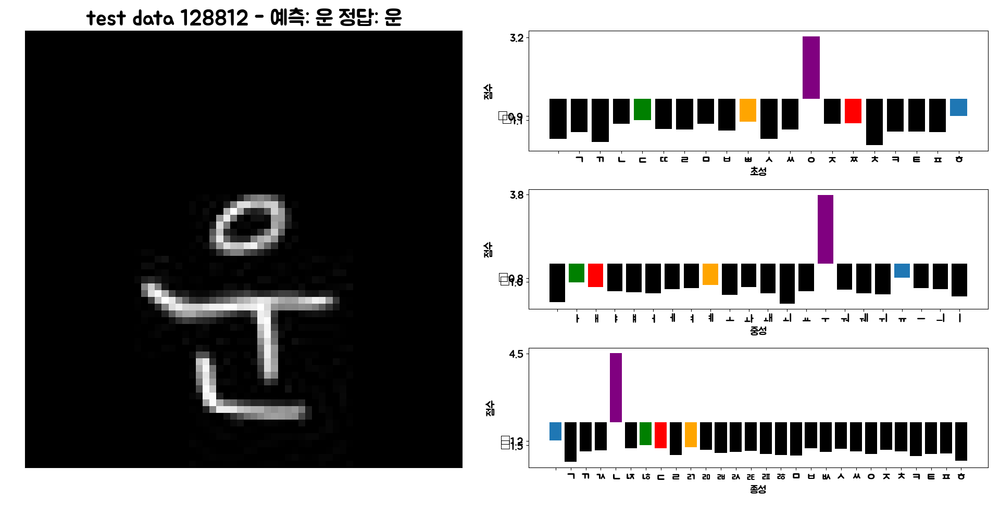
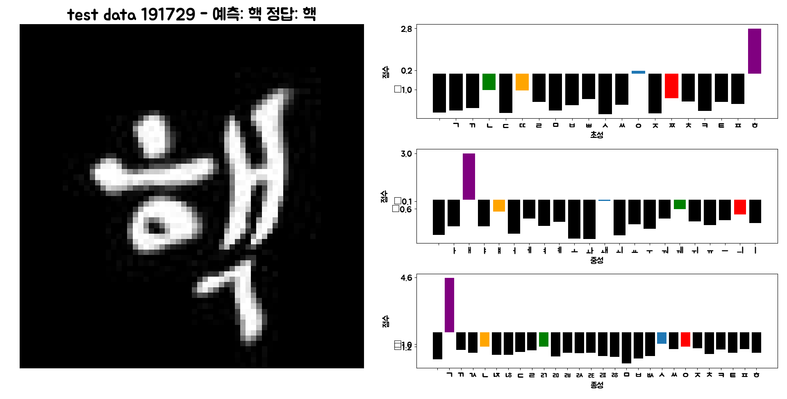
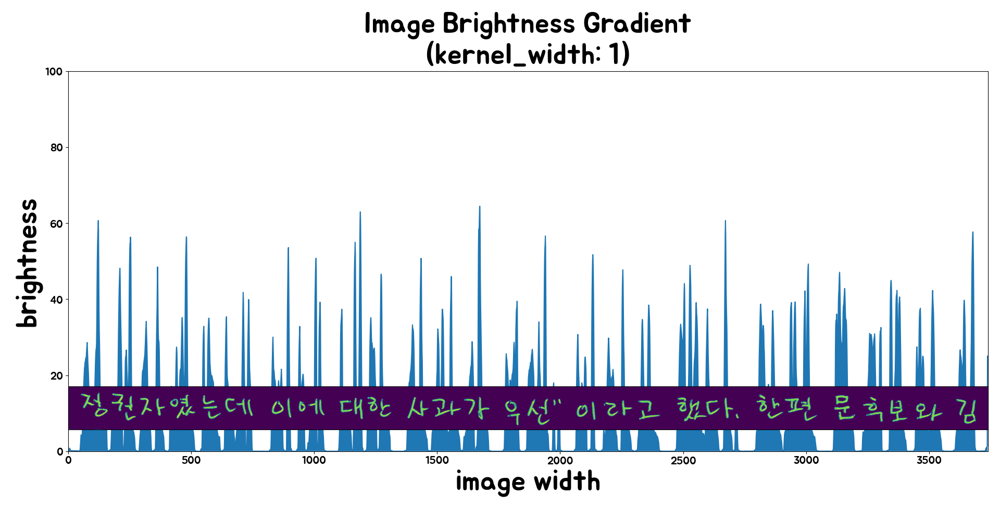
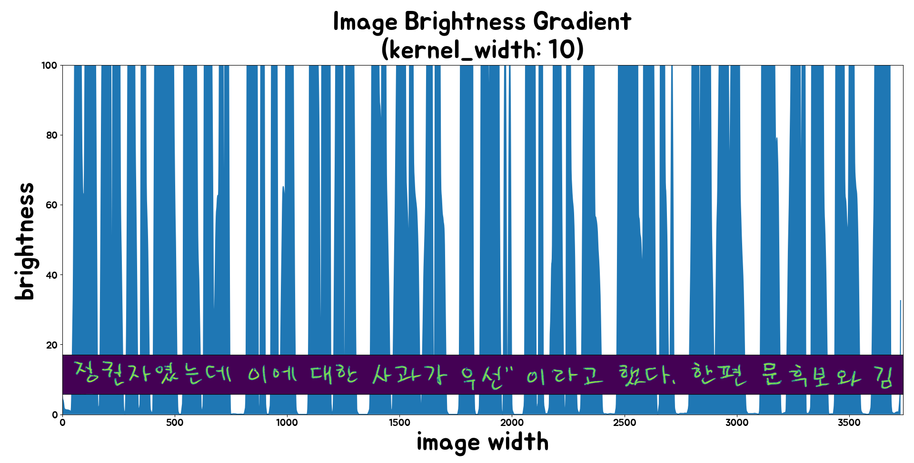
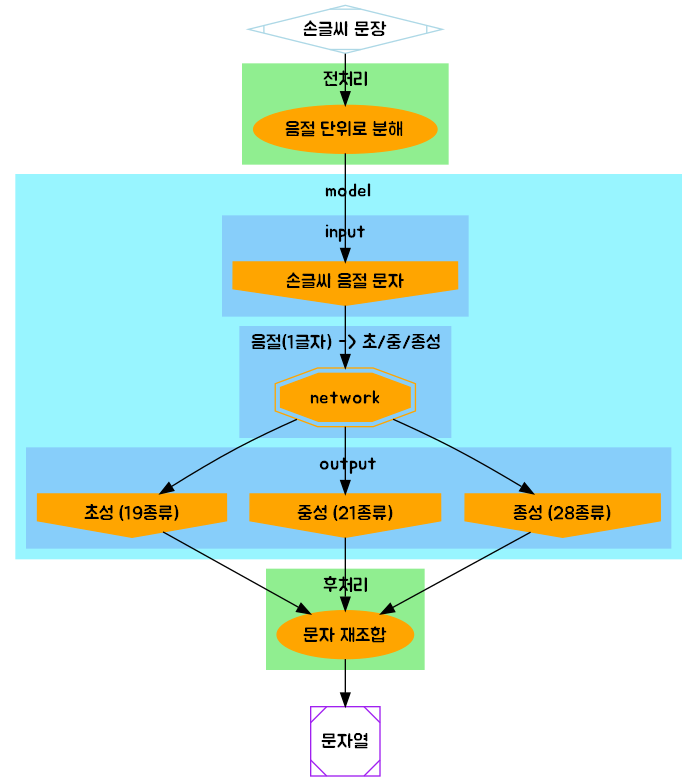

# Handwriting-Detection

### 1. 손글씨 음절을 문자열로 바꾸기 (완성)

### source 
> https://github.com/IBM/tensorflow-hangul-recognition

---

### 결과







---

### Feature Maps


---

### 2. 손글씨 문장을 문자열로 바꾸기 (진행 중)
> [AI Hub 한국어 손글씨 탐지 모델](https://aihub.or.kr/problem_contest/nipa-learning-platform/1)

> [인공지능 놀이터 예제 코드 (Baseline Code)](https://ai-korea.kr/playground/selectTutorialPlayground.do)





---

### 로드맵 (Roadmap)


---

### 1. 필요한 라이브러리 설치 (python 3.10.4)


```python
pip install -r requirements.txt
```

---

### 2. 데이터셋 생성
> 음절 데이터: data-syllable/ 경로에 생성됨

> 문장 데이터: data/ 경로에 생성됨

### 음절 데이터셋 - 반자동 생성

### 문장 데이터셋 - 자동 생성

> data.py 실행 시 [fonts/](fonts/) 안의 폰트들로 음절 데이터셋 생성됨

> [fonts/](fonts/) 에 한글 폰트 추가 필요 [Fonts Download Link](https://hangeul.naver.com/2021/fonts)

```python
# 그 후에 이 파일만 실행시키면 됩니다.
python data.py # 데이터 없으면 생성시킴
```

```python
# 데이터 생성 시 실행되는 파일들
# 1. tools/hangul_image_generator.py
# 2. tools/syllable_to_phoneme.py
# 3. tools/data_seperator.py
```

1. fonts/ 안의 폰트들로 음절 이미지 생성
2. 음절을 음소로 분류한 라벨 생성
3. 전체 데이터셋에서 Test용 데이터셋 분리
---

### 3. 학습
```python
# epoch: 몇 바퀴 학습시킬 건지
# batch_size: 묶어서 학습시킬 수
python train.py --epoch 1 --batch-size 50
```

---

### 4. 테스트

```python 
python test.py --load-model <model path> --batch-size 50
```

---